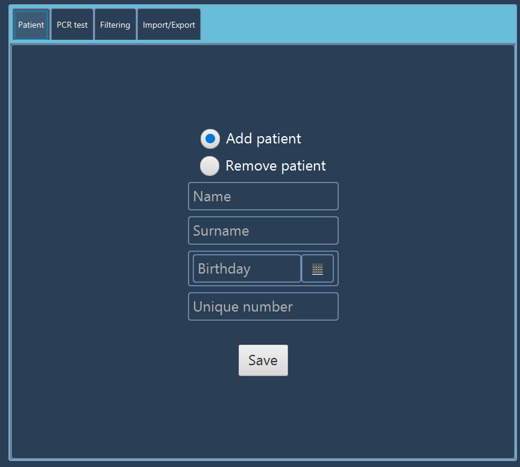
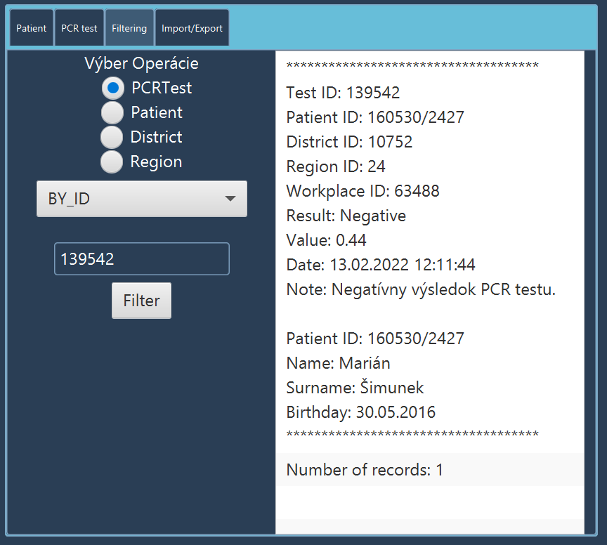

# 🧬 PCRio

> Information system for managing patient records and PCR test results.


---

## 📝 Description

PCRio is a JavaFX desktop information system for managing patient records and PCR test results.

The application provides patient and test management, searching and data persistence while using custom data structures such as AVL Tree and Binary Search Tree for efficient data organization and retrieval.

---

## ✨ Features

- 👤 **Patient Management** — Create, view and manage patient records.
- 🧪 **PCR Test Management** — Store and manage PCR test results.
- 🔍 **Search & Filtering** — Quickly find patients and test records.
- 📋 **Patient Records** — Display patient information and testing history.
- 📊 **Test Results** — View and manage PCR test results.
- 💾 **Data Persistence** — Load and save patient and test data.
- ⚡ **Optimized Data Structures** — Custom data structures designed for efficient data manipulation.
- 🖥️ **Desktop GUI** — JavaFX-based graphical user interface.

---

## 🧠 Data Structures

A key part of PCRio is the use of **custom optimized data structures** for managing application data.

The structures were designed according to the operations required by the application, with a focus on efficient data insertion, retrieval, searching, sorting and filtering.

### Implemented Structures

- **AVL Tree** — Self-balancing binary search tree used for efficient ordered data management and searching.
- **Binary Search Tree** — Tree-based structure used for organizing and efficiently searching application data.

The project demonstrates how selecting an appropriate data structure can improve the efficiency and organization of an application.

---

## 🏗️ Architecture

The application separates the graphical user interface, application logic and data management.

```text
┌─────────────────────────┐
│          VIEW           │
│                         │
│   JavaFX / FXML / CSS   │
└────────────┬────────────┘
             │
             ▼
┌─────────────────────────┐
│       CONTROLLERS       │
│                         │
│   User Input / Events   │
│   Application Flow      │
└────────────┬────────────┘
             │
             ▼
┌─────────────────────────┐
│      BUSINESS LOGIC     │
│                         │
│ Patient Management      │
│ PCR Test Management     │
│ Searching / Filtering   │
└────────────┬────────────┘
             │
             ▼
┌─────────────────────────┐
│     DATA STRUCTURES     │
│                         │
│ AVL Tree / BST          │
└────────────┬────────────┘
             │
             ▼
┌─────────────────────────┐
│      DATA STORAGE       │
│                         │
│    File / Persistence   │
└─────────────────────────┘

```

---


## ⚙️ Installation

### Requirements

* Java JDK 20+
* Apache NetBeans
* SQLite JDBC driver

### 1. Clone the repository

```bash
git clone https://github.com/milos970/pcrio.git
cd pcrio
```

### 2. Open the project

Open the project in **IntelliJ IDEA**.

Maven should automatically detect the pom.xml file and download the required dependencies.

### 3. Build the project
```text
mvn clean install
```

### 4. Run the application

Run the main JavaFX application class from IntelliJ IDEA.

Alternatively, if the project is configured with the JavaFX Maven plugin:
```text
mvn javafx:run
```

## 📸 Screenshots


<p align="center">
  
  
</p>

---

## 🧪 Testing

The application was tested against different data-management scenarios, including:

* Adding patient records
* Updating patient information
* Adding PCR test results
* Searching for records
* Filtering data
* Loading saved data
* Saving modified data
* Handling invalid input

## 🔮 Future Improvements

* [ ] Improve UI/UX
* [ ] Improve data validation

---

## 👨‍💻 Author

**Milos**

Junior Software Developer

[GitHub](https://github.com/milos970)

---

## ⭐ Project Status

🚧 **In Development**
